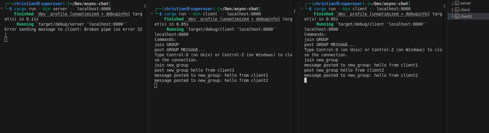

# Async Chat

A real-time asynchronous chat library built in Rust that enables WhatsApp-like group communication functionality.

## Overview

Async Chat is a robust chat system that allows multiple clients to communicate with each other through a central server. The system is built using Rust's async capabilities, providing efficient and scalable group-based communication.

Below is a high-level overview of the system:


## Existing Features

- Asynchronous communication using Rust's async/await
- Group-based chat system
- Multiple client support
- Real-time message delivery

## Planned Features
- Secure groups with passwords
- Group creation and management
- Secure message handling
- WASM (WebAssembly) support

## Prerequisites

- Cargo package manager

## Dependencies

- async-std (1.7) - Async runtime with unstable features
- tokio (1.0) - Async runtime with synchronization features
- serde (1.0) - Serialization framework
- serde_json (1.0) - JSON serialization support
- anyhow (1.0.97) - Error handling

## Installation

Clone the repository using any of the methods below:

- **Using SSH (recommended for developers):**
```bash
git clone git@github.com:Rust-Cameroon/async-chat.git
```

- **Using HTTPS (easier for beginners):**
```bash
git clone https://github.com/Rust-Cameroon/async-chat.git
```

## Usage

1. Start the server:
```bash
cargo run --release --bin server -- localhost:8000
```

2. Start a client:
```bash
cargo run --release --bin client -- localhost:8000
```

### Basic Workflow

1. Start server
2. Clients connect to the server
3. Create and join a group on the server
4. Start sending messages within the group


## Contributing

Please read [CONTRIBUTING.md](CONTRIBUTING.md) for details on our code of conduct and the process for submitting pull requests.
